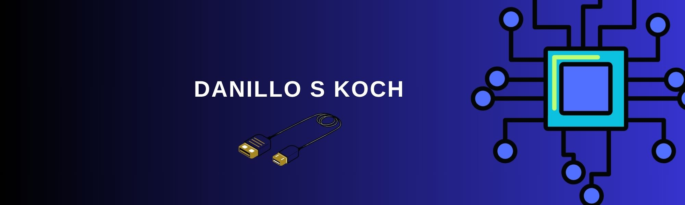

<h1 align="center">Bem-vindo(a) 🚀</h1>

<!-- Ícone do Portfólio -->

  <b>Olá !!! 👋</b>  
  Sou <b>Danillo de Souza Koch</b> 
  Técnico em Automação Industrial e Estudante de Análise e Desenvolvimento de Sistemas.  
  🌍 Busco oportunidades para iniciar minha carreira como desenvolvedor. Tenho interesse em atuar com tecnologias modernas, contribuir em projetos reais e continuar aprendendo diariamente. Meu objetivo é crescer profissionalmente, desenvolvendo soluções que agreguem valor e impacto através da tecnologia!

<!-- Ícone do LinkedIn -->

---

## 💼 Experiência Profissional

### 🔹 Desenhista Mecânico  

- <h4>Desenhista de Layout - Eng. de Fábrica - Krona Tubos e Conexões</h4>
- <h4>Desenhista Mecânico - Setor de Projetos - Dark Calderaria</h4>
- <h4>Desenhista Mecânico - Setor de Projetos - InoxWerk</h4>
- <h4>Desenhista Mecânico - Setor de Projetos - Famak</h4>

### 🔹 Operacionais 

- <h4>Operador CNC - Setor Usinagem - Mecânica Leme</h4>
- <h4>Operador CNC - Setor Usinagem - Schulz Automotiva</h4>
- <h4>Logística - Setor Rodoviário - Forma Gesso</h4>

### 🔹 Desenvolvimento

- Linguagens: Portugol, JavaScript, HTML, CSS

### 🔹 Lazer com Família

- Passeios ao parque

### 🔹 Atividades Físicas & Lazer

- Vôlei

---

## 📫 Contato

📧 **Email:** dsk.danillo@gmail.com

---

## 📚 Conhecimento

---

## 📊 Estatísticas

<a href="https://github.com/GUZ3">
  
  
